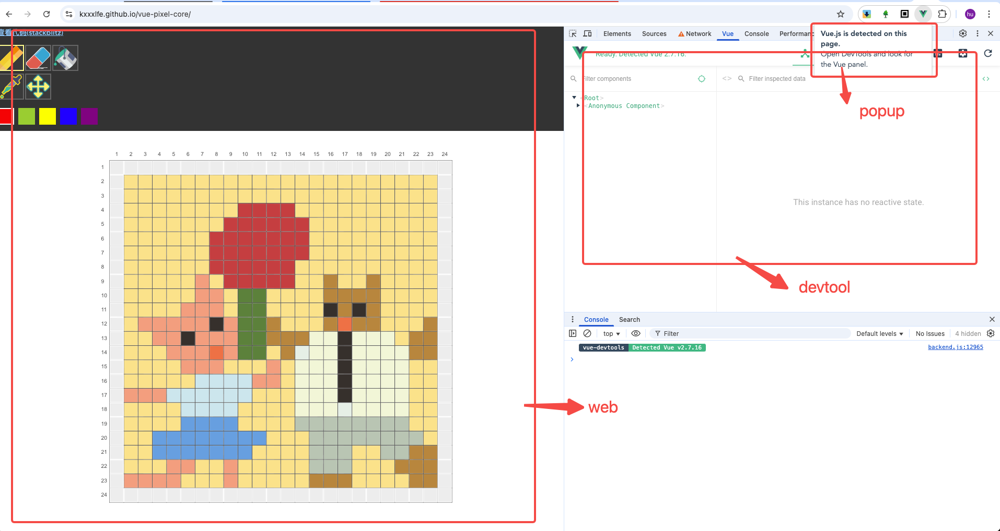

# Chrome bridge

A `Proimse` communication method between `runtime envs`, encapsulating `chrome.runtime.sendMessage` and `window.postMessage`


# Runtime Envs
- web: main page
- [content script](https://developer.chrome.com/docs/extensions/develop/concepts/content-scripts)
- [popup](https://developer.chrome.com/docs/extensions/develop/ui/add-popup)
- [devtool](https://developer.chrome.com/docs/extensions/how-to/devtools/extend-devtools)
- [extension service worker](https://developer.chrome.com/docs/extensions/develop/concepts/service-workers/basics)
- iframe: `<iframe src="...">`
- opener: `window.open()`



# Usage

```typescript
// content script 
// must be required, if you want to request `web`
import { ContentBridge } from '@yuhufe/browser-bridge'
export const contentBridge = new ContentBridge() 

// web
import { WebBridge, Plat } from '@yuhufe/browser-bridge'
export const webBridge = new WebBridge();
webBridge.on(`${Plat.web}/getPiniaInfo`, async function({ key }) {
  console.log(key); // 'board'
  return Promise.resolve({ a: 1 });
});


// devtool.js
import { DevtoolBridge, Plat } from '@yuhufe/browser-bridge'
export const devtoolBridge = new DevtoolBridge() // must be required, if you want to request `web`

const piniaInfo = await devtoolBridge.request(`${Plat.web}/getPiniaInfo`, { key: 'board' });
console.log(piniaInfo); // { a: 1 }
```

notice：
- `request` and `on` should use same `path`
- `path` must be start with `${Plat.*}` format，implied who's `server`
- Every bridge should init only once，because `addEventListener` should listen once
- If need request `web`，must `new` `ContentBridge`，because we need `content script` proxy `web`

# Install

```
npm install @yuhufe/browser-bridge
```
